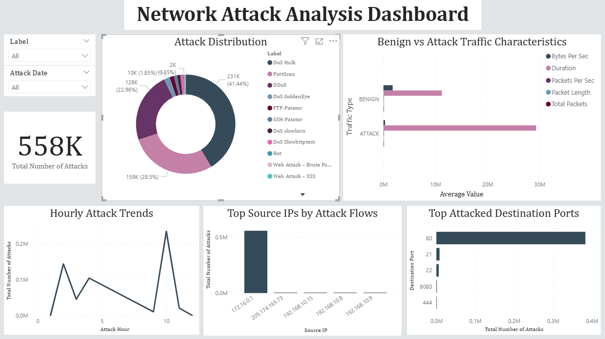
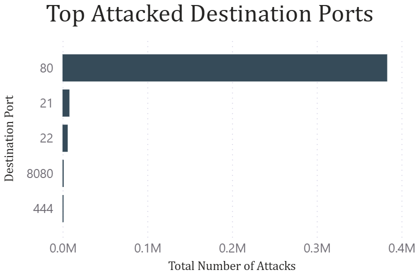
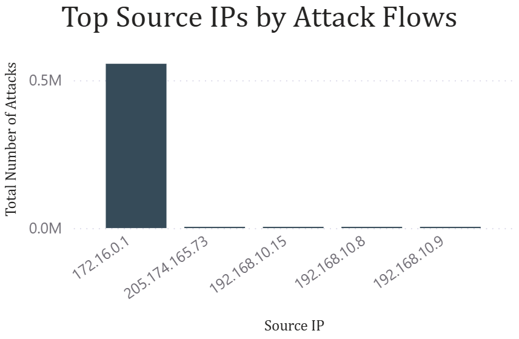
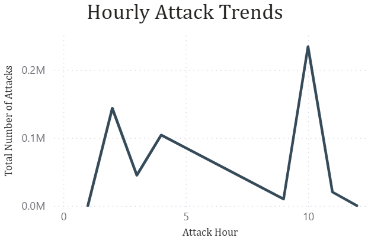
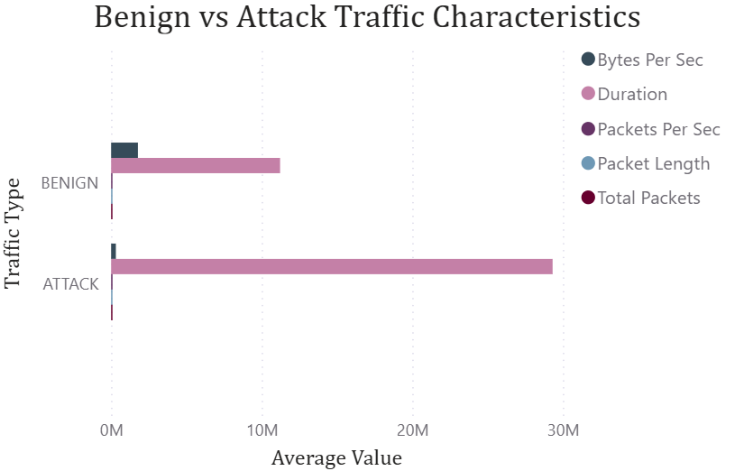

# Network Traffic Data-Analysis Project

## 📄 Summary
Analyzed network traffic data from the IDS 2017 dataset to compare benign vs. attack traffic, identify the most frequent attack types, top attacked ports, high-risk source IPs, and hourly attack trends. Built an interactive Power BI dashboard with dynamic slicers to visualize patterns over time and provide actionable cybersecurity insights.

- **Tools:** SQL, Power BI
- **Dataset:** IDS 2017 (Canadian Institute for Cybersecurity) — https://www.unb.ca/cic/datasets/ids-2017.html

---

## 📊 Dashboard (Screenshots)
*(Exported from Power BI for easy viewing)*

**Overview**  

**Top Attacked Destination Ports**  

**Top Source IPs by Attack Flows**  

**Hourly Attack Trends**  

**Benign vs Attack Traffic Characteristics**  

> Optional full report: [PDF Export](screenshots/dashboard.pdf)

---

## 🛠️ How It’s Built
- **SQL (data prep & aggregation)**  
  - Queries were used to summarize and shape the network traffic data.  
  - Aggregations include attack counts by type, source IP, destination port, and hourly trends. 

- **Power BI (visualization)**  
  - Date & label slicers for interactive filtering
  - Donut chart for attack distribution  
  - Bar/column charts for ports & source IPs  
  - Line chart for hourly trends  
  - Clustered bar for benign vs attack characteristics  

---

## 🔎 Key Insights 

**Most Frequent Attacks:** The top attack types observed were **DoS Hulk**, **Portscan**, and **DDoS**, highlighting common methods used in network intrusion attempts.

**Targeted Destination Ports:** Port **80** was the most frequently targeted, indicating attackers primarily aimed at web services.

**Traffic Characteristics:**

- **Benign traffic** has a higher average bytes per second, showing regular network activity is more consistent in volume.  
- **Attack traffic** exhibits significantly longer durations, suggesting prolonged or sustained attack attempts.

**High-Risk Source IPs:** The IP **172.16.0.1** was the most active source of attacks, representing a critical point for monitoring and mitigation.

**Peak Attack Time:** The majority of attacks occurred around **10 AM**, indicating potential patterns in attacker behavior or network vulnerability periods.

---
## 🛡️ Mitigation Strategies
Based on the analysis of network traffic, the following measures could help reduce attacks:

- **Monitor high-risk source IPs:** Implement firewall rules or intrusion prevention for IPs like 172.16.0.1.  
- **Harden web services:** Since port 80 is frequently targeted, ensure web servers are patched and properly configured.  
- **Traffic anomaly detection:** Use thresholds for bytes per second and connection duration to detect unusual activity.  
- **Time-based monitoring:** Increase monitoring around peak attack hours (e.g., 10 AM) to quickly respond to potential attacks.  
- **User awareness and training:** Educate internal users to reduce risk from common attack vectors like scanning or DoS attempts.

---

## 📝 Notes
- This project is for portfolio/demonstration purposes using publicly available data (IDS 2017).
- No sensitive or proprietary data is included.
